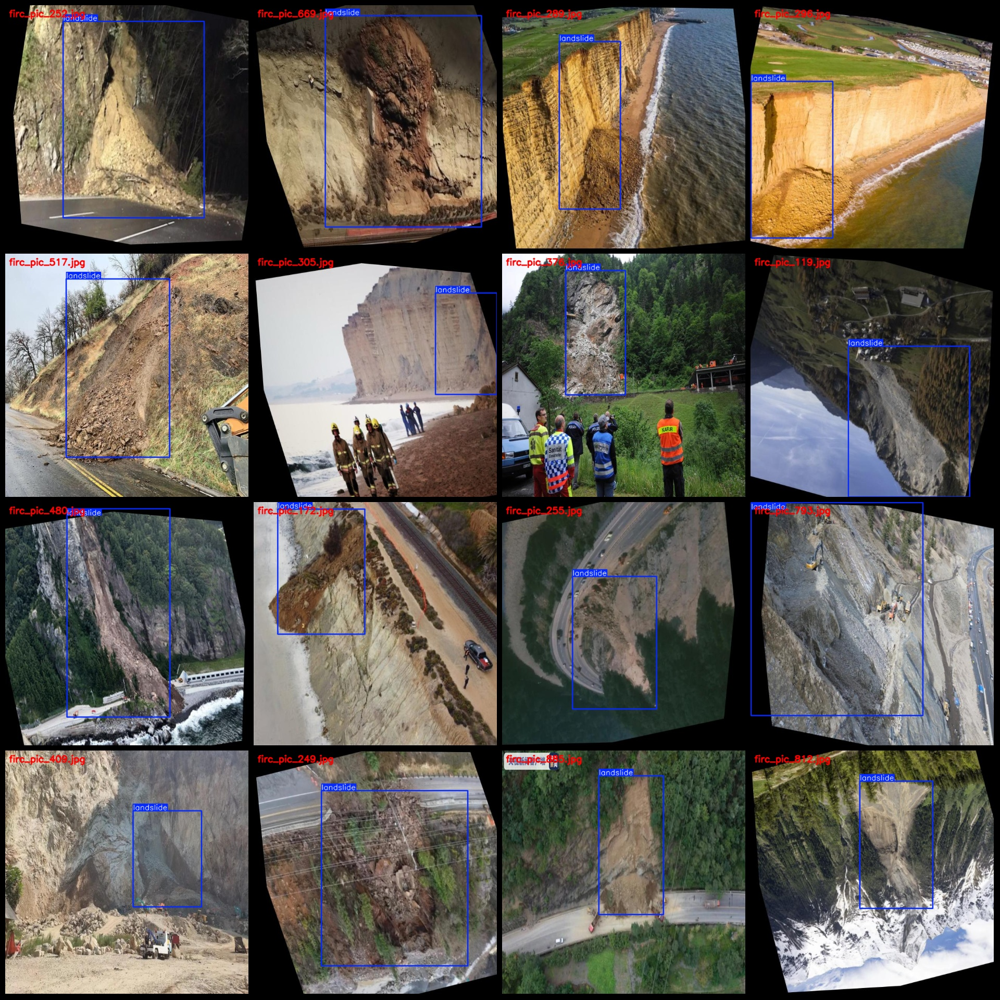
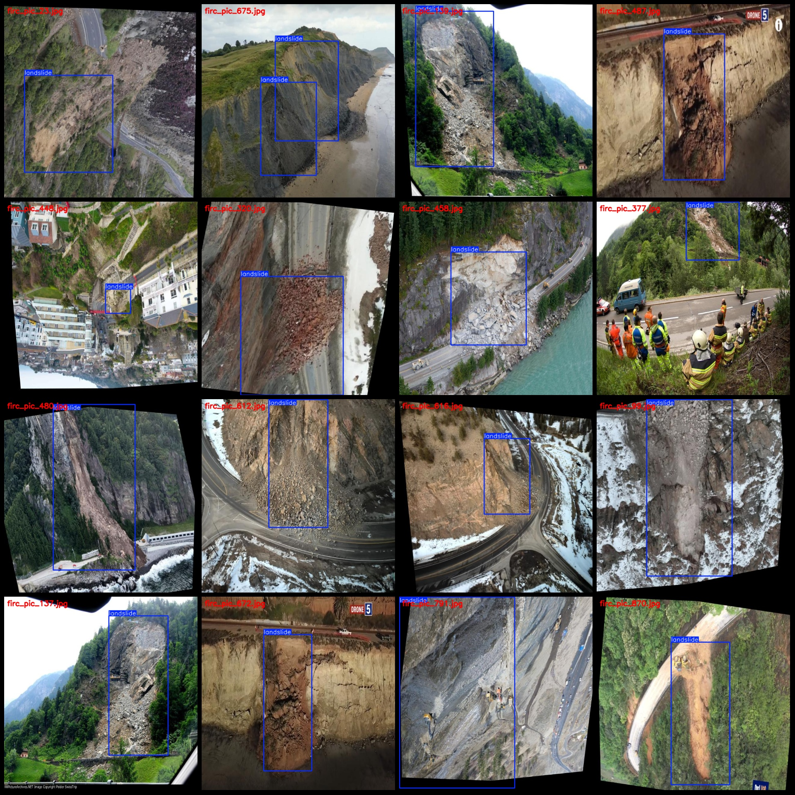

# UAV Perspective Slope and Landslide Area Detection Dataset VOC+YOLO Format with 968 Images of 1 Category with Enhancing

Note that approximately 390 images are original and the remaining are rotated enhancement images. Please refer to the images for details.

The dataset format is Pascal VOC format combined with YOLO format (excluding the split path in the txt file, only containing JPG images and corresponding VOC format xml files and YOLO format txt 
files).

Number of images (JPG file count): 968
Number of annotations (xml file count): 968
Number of annotations (txt file count): 968
Number of categories: 1
Annotation category name: ["landslide"]
Number of bounding boxes per category:
- "landslide" bounding box count = 1026
Total bounding box count: 1026
Number of images occupied by each category:
- "landslide" occupied image count = 968
Image resolution: 640x640
Annotation tool used: labelImg
Annotation rules: draw bounding boxes for categories
Important note: The dataset does not have a split for training, validation, or test sets. You need to divide it yourself.
Special notice: This dataset does not guarantee the accuracy of models or weights trained on it.

Image preview:
Annotation example:

## Images

Here is a pay link on Stripe ( https://buy.stripe.com/3cs8yP7sY87d0vu9AB ). Please contact me lonlonago@foxmail.com after funding $89, and I will send you a complete data files , thank you!

